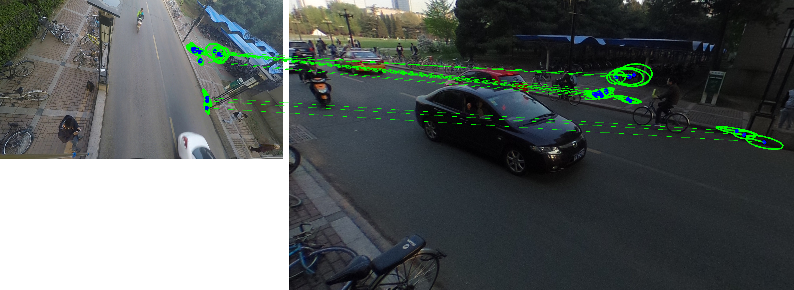

MODS
======
MODS: Fast and Robust Method for Two-View Matching

Clone from http://cmp.felk.cvut.cz/wbs/

Very strong algorithm for two-view matching problem under large variations (e.g. poses or illuminations).

Using SConstruct to build, run scons

To test, cd samples; ./run_mods.sh
